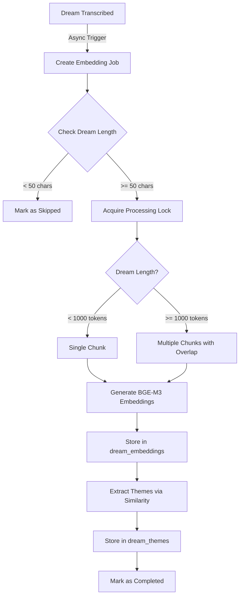

# Dream Embedding System Documentation

## Overview

The Dream Embedding System generates semantic embeddings for dream transcriptions to enable:
- Semantic search across dreams
- Automatic theme extraction
- Similar dream discovery
- Future: Personalized insights and patterns

## Architecture

### Core Components

1. **Database Schema** (`migrations/20250125_dream_embeddings_system.sql`)
   - `dream_embeddings`: Stores chunked BGE-M3 embeddings (1024 dimensions)
   - `dream_themes`: Maps dreams to extracted themes
   - `embedding_jobs`: Async job queue for processing
   - Dream table extensions: `embedding_status`, `embedding_error`, etc.

2. **Services**
   - `DreamEmbeddingService` (`services/dreamEmbedding.ts`): Core embedding logic
   - `BGEEmbeddingsService` (`services/embeddings-bge.service.ts`): BGE-M3 model wrapper
   - `EmbeddingWorker` (`workers/embeddingWorker.ts`): Background job processor

3. **API Endpoints** (`routes/dreamEmbedding.ts`)
   - `POST /api/v1/dream-embeddings/process`: Manual embedding trigger
   - `GET /api/v1/dream-embeddings/search`: Semantic dream search
   - `GET /api/v1/dream-embeddings/themes/:dreamId`: Get dream themes
   - `GET /api/v1/dream-embeddings/status/:dreamId`: Check processing status
   - `GET /api/v1/dream-embeddings/worker/status`: Worker health check

## Processing Flow



## Key Design Decisions

### 1. Async Processing
- **Decision**: Completely decoupled from transcription flow
- **Rationale**: No impact on transcription performance
- **Implementation**: Fire-and-forget with job queue

### 2. Adaptive Chunking
- **Short dreams** (< 1000 tokens): Single chunk
- **Long dreams** (>= 1000 tokens): 750-token chunks with 100-token overlap
- **Rationale**: Preserve context while enabling granular search

### 3. BGE-M3 Model
- **1024 dimensions** (vs 384 for MiniLM)
- **8192 token support** for long documents
- **Better semantic understanding** for philosophical/psychological content
- **Rationale**: Superior performance for dream analysis

### 4. Theme Extraction
- **Similarity threshold**: 0.6 (configurable)
- **Max themes per dream**: 5
- **Method**: Cosine similarity against pre-computed theme embeddings

### 5. Error Handling
- **Retry logic**: Up to 3 attempts with exponential backoff
- **Stale job cleanup**: 30-minute timeout
- **Graceful degradation**: Dreams remain functional without embeddings

## Database Schema Details

### dream_embeddings
```sql
CREATE TABLE dream_embeddings (
  id BIGSERIAL PRIMARY KEY,
  dream_id UUID REFERENCES dreams(id),
  embedding vector(1024),
  chunk_index INT,
  chunk_text TEXT,
  token_count INT,
  embedding_version TEXT DEFAULT 'bge-m3-v1',
  processing_time_ms INT,
  metadata JSONB,
  created_at TIMESTAMPTZ
);
```

### dream_themes
```sql
CREATE TABLE dream_themes (
  id BIGSERIAL PRIMARY KEY,
  dream_id UUID REFERENCES dreams(id),
  theme_code TEXT REFERENCES themes(code),
  similarity FLOAT CHECK (similarity >= 0 AND similarity <= 1),
  chunk_index INT,
  extracted_at TIMESTAMPTZ
);
```

### embedding_jobs
```sql
CREATE TABLE embedding_jobs (
  id BIGSERIAL PRIMARY KEY,
  dream_id UUID REFERENCES dreams(id),
  status TEXT CHECK (status IN ('pending', 'processing', 'completed', 'failed')),
  priority INT DEFAULT 0,
  attempts INT DEFAULT 0,
  max_attempts INT DEFAULT 3,
  error_message TEXT,
  scheduled_at TIMESTAMPTZ,
  started_at TIMESTAMPTZ,
  completed_at TIMESTAMPTZ
);
```

## API Usage Examples

### Manual Embedding Generation
```bash
curl -X POST https://api.somni.app/api/v1/dream-embeddings/process \
  -H "Authorization: Bearer $TOKEN" \
  -H "Content-Type: application/json" \
  -d '{"dreamId": "uuid-here"}'
```

### Search Similar Dreams
```bash
# By query text
curl -G https://api.somni.app/api/v1/dream-embeddings/search \
  -H "Authorization: Bearer $TOKEN" \
  --data-urlencode "query=flying through clouds" \
  --data-urlencode "limit=10" \
  --data-urlencode "threshold=0.7"

# By existing dream
curl -G https://api.somni.app/api/v1/dream-embeddings/search \
  -H "Authorization: Bearer $TOKEN" \
  --data-urlencode "dreamId=uuid-here" \
  --data-urlencode "limit=5"
```

### Get Dream Themes
```bash
curl https://api.somni.app/api/v1/dream-embeddings/themes/uuid-here \
  -H "Authorization: Bearer $TOKEN"
```

## Monitoring & Operations

### Worker Health
The embedding worker processes jobs every 5 seconds with:
- Max 2 concurrent jobs
- Automatic retry with exponential backoff
- Stale job cleanup every 5 minutes

### Metrics to Track
- Embedding generation time per dream
- Queue depth (pending/processing jobs)
- Failure rate by error type
- Theme extraction accuracy
- Memory usage of BGE service

### Common Issues & Solutions

1. **High Memory Usage**
   - Cause: BGE-M3 model is large (1024D)
   - Solution: Adjust batch size, implement memory cleanup

2. **Slow Processing**
   - Cause: Large dreams with many chunks
   - Solution: Increase worker concurrency, optimize chunking

3. **Theme Extraction Failures**
   - Cause: Missing theme embeddings
   - Solution: Ensure themes table has embeddings

## Future Enhancements

1. **Multi-language Support**
   - Currently English-only
   - Plan: Language-specific embeddings

2. **Real-time Updates**
   - WebSocket notifications for completion
   - Progress tracking for long dreams

3. **Advanced Search**
   - Hybrid search (semantic + keyword)
   - Date range filtering
   - Theme-based filtering

4. **Analytics Dashboard**
   - Recurring themes over time
   - Dream similarity clusters
   - Personal pattern detection

## Testing

### Unit Tests
```typescript
// Test chunking logic
describe('DreamEmbeddingService', () => {
  it('should create single chunk for short dreams', async () => {
    const chunks = service.createAdaptiveChunks('Short dream text');
    expect(chunks).toHaveLength(1);
  });
  
  it('should create overlapping chunks for long dreams', async () => {
    const longText = 'Very long dream...'.repeat(200);
    const chunks = service.createAdaptiveChunks(longText);
    expect(chunks.length).toBeGreaterThan(1);
    // Verify overlap exists
  });
});
```

### Integration Tests
1. Create dream → Trigger embedding → Verify completion
2. Search similar dreams → Verify relevance
3. Extract themes → Verify accuracy

## Deployment Checklist

1. **Database Migration**
   ```bash
   supabase migration up 20250125_dream_embeddings_system
   ```

2. **Environment Variables**
   - Ensure BGE model path is configured
   - Set worker intervals if needed

3. **Start Services**
   - Backend server starts embedding worker automatically
   - Monitor logs for successful initialization

4. **Verify Operations**
   - Check worker status endpoint
   - Process test dream manually
   - Verify theme extraction works

## Security Considerations

1. **RLS Policies**
   - Users can only access embeddings for their own dreams
   - Service role required for job management

2. **Rate Limiting**
   - Manual processing limited per user
   - Search queries rate-limited

3. **Data Privacy**
   - Embeddings don't contain readable text
   - Chunk text stored for debugging only